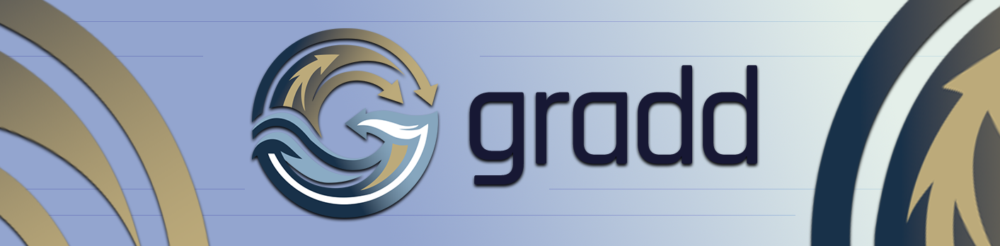
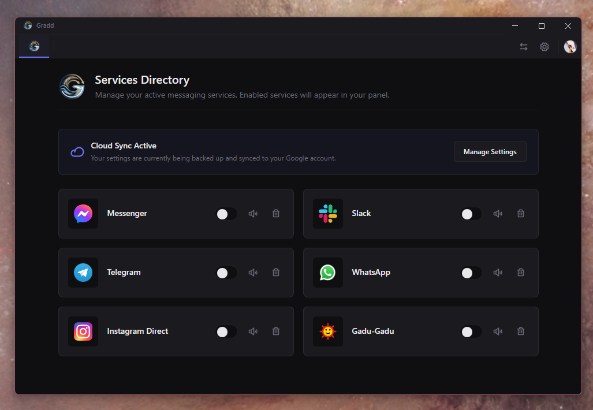

  
    
  
<strong>All your messaging apps in one place - the app Rambox should have been.</strong>

  

    
    
    
    
    
  

---

Gradd is a Windows desktop application that aggregates multiple messaging platforms - Messenger, WhatsApp, Telegram, Slack, Instagram, and Gadu-Gadu - into a single polished interface. Each service runs in its own fully isolated Chromium session, so logins never bleed between tabs and notifications fire independently per service.

## Screenshots

  
    

## Features

- **Multi-service aggregation** - Switch between WhatsApp, Telegram, Messenger, Slack, Instagram, and Gadu-Gadu from a unified sidebar or tab bar.
- **Complete session isolation** - Every service uses its own Chromium partition (`persist:service-<id>`), so cookies, storage, and credentials are fully sandboxed.
- **Google Cloud Sync** - Log in with your Google account to sync your layout, service order, and DND schedule across devices via Firestore.
- **Local Backup & Restore** - Export and import your full configuration as a JSON file without cloud credentials.
- **Do Not Disturb** - Toggle DND manually or set a recurring schedule (supports midnight wrap). Mutes all audio and blocks OS notifications while active.
- **Per-service mute** - Mute audio for individual services independently of DND.
- **Unread badges** - Live unread count badges on each service icon and a Windows taskbar overlay.
- **Native notifications** - OS-level toast notifications via the Windows Action Center when a service fires a web notification.
- **Auto-updates** - Seamless updater powered by `electron-updater` and GitHub Releases.
- **Dual layouts** - Compact top tab bar or a detailed left sidebar; choice persists across restarts.
- **Drag-to-reorder** - Drag service icons to rearrange them in your preferred order.
- **System tray** - Minimise to the tray and keep everything running in the background.

## Installation

Download the latest release from the [Releases](https://github.com/ViFurzy/gradd/releases) page.

| Package | Description |
|---------|-------------|
| `gradd-app-x.x.x-setup.exe` | NSIS installer - recommended, creates Start Menu shortcut |
| `gradd-app-x.x.x.exe` | Portable - no install needed, runs from any folder |

> **Note:** Windows may show a SmartScreen warning on first launch because the binary is not EV code-signed yet. Click **More info → Run anyway** to proceed.

## Privacy & Security

- Messages and credentials are **never** sent to any Gradd server - all message data stays in Chromium's local partition storage.
- Cloud Sync stores only layout preferences (service list, DND schedule, layout mode) - no message content.
- Google OAuth uses the PKCE flow with a loopback server on an OS-assigned port; no client secret is required for the native-app flow.
- The Google refresh token is encrypted using the OS keyring via Electron's `safeStorage` API before being written to disk.
- Service WebContentsViews run with `sandbox: true` - Chromium renderer exploits are contained and cannot reach Node.js.
- The `import-config` handler validates the schema and rejects any file whose service URLs use non-http(s) schemes.

## Contributing

Pull requests are welcome. For major changes, open an issue first to discuss the approach.

1. Fork the repository
2. Create a feature branch: `git checkout -b feature/my-change`
3. Commit your changes: `git commit -m "feat: describe the change"`
4. Push and open a Pull Request

## License

[MIT](LICENSE) - made by [ViFurzy](https://vi-design.pro)
