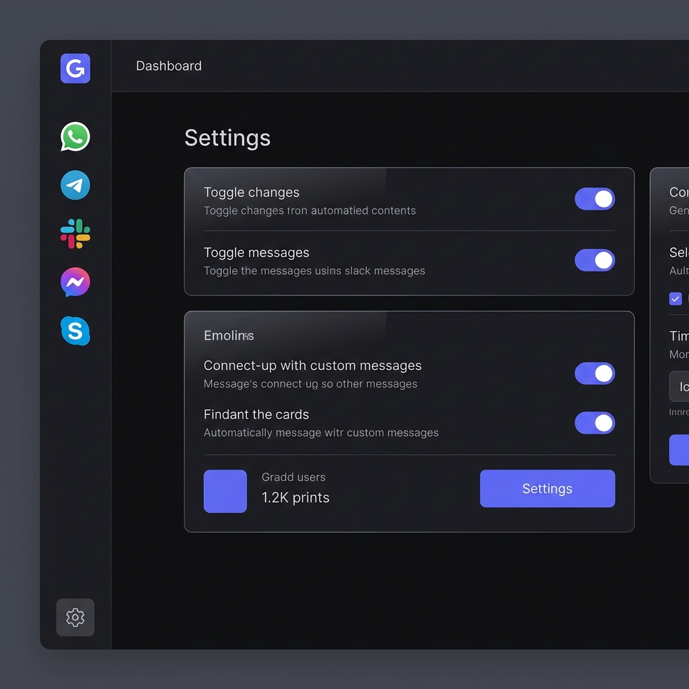

  
   
  

   
   

  **Gradd** is a highly polished, modern Windows desktop application that aggregates your favorite messaging platforms into a single, unified interface. Built with performance and elegance in mind, Gradd isolates each service securely and offers seamless cloud synchronization.

 

## ✨ Features

- **Multi-Service Aggregation**: Seamlessly switch between WhatsApp, Telegram, Messenger, Slack, Instagram, and Gadu-Gadu.
- **Secure Isolation**: Each messaging service runs in its own sandboxed Chromium WebView to ensure privacy and security.
- **Cloud Synchronization**: Log in with Google to automatically back up and sync your layouts, settings, and Do Not Disturb schedules across multiple devices.
- **Local Backup & Restore**: Export and import your exact configurations locally.
- **Smart Do Not Disturb (DND)**: Schedule automatic quiet hours or manually mute all notifications across all services instantly.
- **Customizable Layouts**: Choose between a compact top Tab Bar or a detailed left Sidebar layout.
- **Auto-Updates**: Built-in seamless updater keeps your app up-to-date directly from GitHub releases.

 

  <h3>Settings Panel</h3>
  
  
    
  
  <h3>Services Directory (Sidebar Layout)</h3>
  
  
    
  
  <h3>Services Directory (Tab Bar Layout)</h3>
  

 

## 🛠️ Getting Started

### Installation

1. Go to the [Releases](https://github.com/ViFurzy/gradd/releases) page.
2. Download the latest installer (`gradd-app-1.0.0-setup.exe`) or the Portable version.
3. Run the installer and you're good to go!

## 🔒 Privacy & Security

Gradd takes your privacy seriously.
- All web sessions are heavily sandboxed using Electron's `WebContentsView`.
- We block third-party trackers, ad scripts, and unnecessary background polling.
- Cloud Sync securely stores only your layout preferences, not your messages or credentials.

## 📄 License

MIT License
